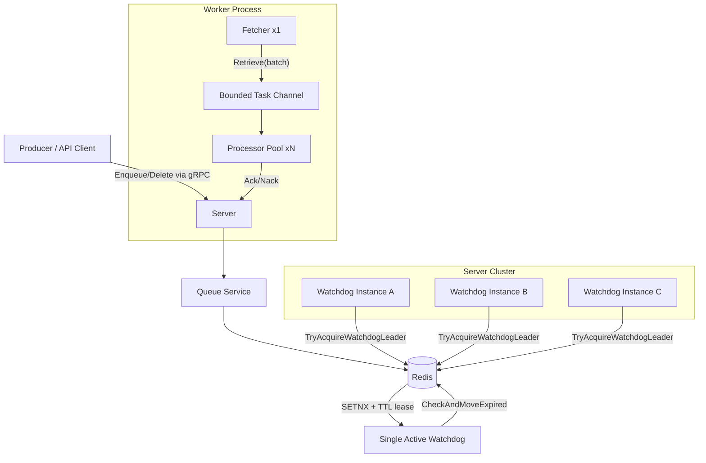

# Async Task Platform

[](https://go.dev/)
[](https://redis.io/)
[](LICENSE)

Async Task Platform is a Redis-backed, gRPC-based asynchronous task scheduler designed for high-throughput concurrent processing and distributed fault tolerance.

v0.2.0 includes:
- Delayed task enqueue/retrieve/ack/nack/delete API loop.
- Worker Pool execution model (`1 Fetcher + N Processor`) with bounded in-memory queue.
- Watchdog recovery with Redis lease-based leader election (`SETNX + TTL`) to avoid multi-node scan storms.
- Integration tests using real Redis containers (`testcontainers-go`).

## Overview

This project targets production-grade scheduling fundamentals:
- Atomic retrieval and state transition (`pending -> running`) via Lua scripts.
- Retry and dead-letter handling (`nack`, max retry budget).
- Idempotent enqueue support:
  - `idempotency_key` for request-level deduplication.
  - custom `id` deduplication via Redis atomic reservation.
- Idempotent delete behavior for safe retries by clients.

## Architecture



### Key Redis Structures
- `ddq:tasks` (ZSet): pending delayed tasks
- `ddq:running` (Hash): in-flight tasks with start timestamp
- `ddq:dlq` (List): dead-letter tasks
- `ddq:idempotency:*` (String): `idempotency_key -> task_id`
- `ddq:taskid:*` (String): custom task id reservation
- `ddq:watchdog:leader` (String): watchdog leader lease key

## Quick Start

### Prerequisites
- Go 1.25+
- Docker / Docker Desktop
- `make`
- `grpcurl` (`go install github.com/fullstorydev/grpcurl/cmd/grpcurl@latest`)

### 1) Start Redis

```bash
make up
```

### 2) Start Server

```bash
make run-server
```

### 3) Start Worker

```bash
make run-worker
```

You can also run with explicit Worker Pool settings:

```bash
go run cmd/worker/main.go \
  -server-addr localhost:9090 \
  -processors 8 \
  -queue-capacity 256 \
  -batch-size 32 \
  -poll-interval 500ms
```

### 4) Submit Tasks via gRPC

Enqueue:

```bash
grpcurl -plaintext -d '{
  "id": "order-1001-timeout",
  "topic": "order-timeout",
  "payload": "{\"order_id\":1001}",
  "delay_seconds": 10,
  "max_retries": 3
}' localhost:9090 api.queue.DelayQueueService/Enqueue
```

Delete:

```bash
grpcurl -plaintext -d '{
  "id": "order-1001-timeout"
}' localhost:9090 api.queue.DelayQueueService/Delete
```

### 5) Stop Redis

```bash
make down
```

## Development

Common targets:

```bash
make fmt
make lint
make test
```

Run focused integration suites:

```bash
go test ./internal/storage/redis -run TestStoreIntegration -count=1
go test ./internal/queue -run TestServiceIntegration -count=1
```

## License

MIT License. See `LICENSE`.
