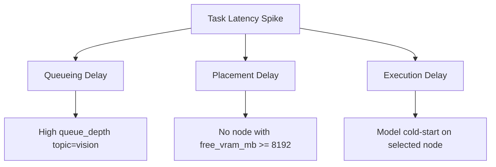
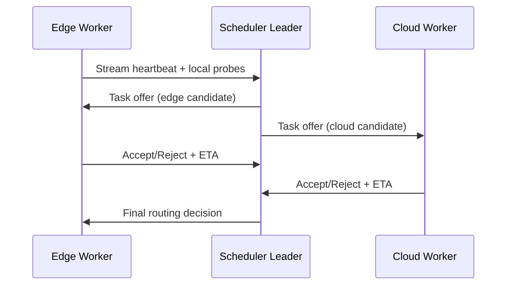

# RFC 003: Systems + HCI Evolution for Async Task Platform (v0.4.0+)

- Status: Draft
- Owners: Platform Architecture Group
- Last Updated: 2026-02-19
- Target Milestones: v0.4.0 to v0.6.x

## Abstract
This RFC proposes the next evolution of the Async Task Platform from a time-based delay queue into a resource-aware, explainable, and edge-integrated execution system.

The design combines:
- **MLSys principles**: resource-aware placement, bin-packing, and heterogeneous worker orchestration.
- **HCI principles**: explanatory performance feedback via attribution trees, not just raw metrics.
- **Distributed systems robustness**: leader-based coordination, idempotent dispatch, and observable control loops.

The objective is to support AI inference and mixed workloads while giving operators and end-users clear, actionable explanations for latency and placement outcomes.

---

## 1. Context and Problem Statement

The current platform is robust for delayed task execution and concurrent processing, with:
- queue and worker baseline metrics (`task_enqueue_total`, `task_process_duration_seconds`, `queue_depth`)
- watchdog leader election in Redis (`SETNX + TTL`)
- stable fetcher/processor worker pool

However, v0.4.0+ workloads introduce new constraints:
- tasks may require explicit compute resources (for example GPU VRAM and minimum throughput)
- workers become heterogeneous (CPU-only, low-VRAM GPU, high-VRAM GPU, edge devices)
- users need interpretable answers for tail-latency events
- edge-to-cloud placement should be dynamic instead of hardcoded

The current `execute_time`-only model is insufficient for these goals.

---

## 2. Goals and Non-Goals

## Goals
- Add resource-aware scheduling without breaking existing delay queue semantics.
- Provide a first-class explanation API for latency and placement decisions.
- Enable bi-directional streaming for edge workers and cloud workers.
- Introduce policy-driven cloud/edge offloading with safety guards.

## Non-Goals
- Full global optimal scheduling (NP-hard exact optimization is out of scope).
- End-to-end model serving framework replacement.
- Cross-region consistency protocol redesign in this RFC.

---

## 3. Proposal A: From Time-Based to Resource-Aware Scheduling (MLSys)

## 3.1 Task Contract Evolution

Add a new optional resource profile to task metadata while keeping backward compatibility.

```proto
// Conceptual extension, field numbers are placeholders.
message ResourceDemand {
  int64 min_vram_mb = 1;           // hard lower bound (0 means no GPU required)
  double estimated_flops = 2;      // approximate compute demand
  int32 min_cpu_cores = 3;
  int64 min_memory_mb = 4;
  string accelerator = 5;          // e.g. "cuda", "metal", "none"
  string latency_class = 6;        // e.g. "interactive", "batch"
}

message PlacementHints {
  bool edge_preferred = 1;
  bool data_locality_required = 2;
  string tenant = 3;
  string model_id = 4;
}
```

Backward compatibility rules:
- Existing tasks without resource demand remain valid.
- Missing fields default to current behavior (time-based scheduling only).
- Validation rejects physically impossible requests (`min_vram_mb < 0`, invalid accelerator tags).

## 3.2 Worker Evolution: Dynamic Nodes with Local Probes

Workers should periodically report capabilities and utilization:
- static capabilities: accelerator type, total VRAM, CPU cores
- dynamic probes: free VRAM, queue length, thermal/throttle state, failure streak
- latency telemetry: recent p50/p95 processing time per model/topic

Suggested control-plane message:

```proto
message WorkerHeartbeat {
  string worker_id = 1;
  string node_class = 2;           // "cloud-heavy", "cloud-standard", "edge-mobile"
  int64 total_vram_mb = 3;
  int64 free_vram_mb = 4;
  int32 cpu_cores = 5;
  double utilization = 6;          // 0..1
  map<string, double> model_tps = 7;
  int64 timestamp_unix_ms = 8;
}
```

## 3.3 Scheduler Architecture and Bin-Packing Strategy

Use a two-stage scheduler:
1. **Feasibility filter**: remove nodes that violate hard constraints.
2. **Score + pack**: choose candidate with best cost under a bin-packing heuristic.

Recommended heuristic for v0.4.0:
- **Dominant Resource Best Fit (DR-BF)**:
  - dominant dimension = max(normalized CPU, memory, VRAM demand)
  - place on node minimizing residual dominant slack
  - tie-breaker: lower observed p95 for task topic/model

Scoring template:

`score(node, task) = w1*fit + w2*latency + w3*queue_pressure + w4*handoff_cost + w5*reliability_penalty`

Where:
- `fit` rewards tight but safe packing
- `latency` uses rolling topic/model latency
- `queue_pressure` uses `queue_depth` and local queue occupancy
- `handoff_cost` penalizes remote transfer when payload/model is large
- `reliability_penalty` penalizes unstable workers

## 3.4 Coordination with Existing Leader Mechanism

Reuse Redis lease semantics (current watchdog pattern) for scheduler leadership:
- key: `ddq:scheduler:leader`
- acquire via `SETNX + TTL`
- renew only if owner matches (Lua compare-and-renew)

Only leader performs global placement decisions and dispatch reservations.
If leader crashes, TTL expiry enables takeover.

---

## 4. Proposal B: Explanatory Performance Modeling (HCI)

## 4.1 Why Explanations, Not Just Dashboards

Raw metrics are insufficient for user trust and operational decisions.
When a task is slow, the system should answer:
- what happened
- why it happened
- what likely action will improve it

## 4.2 Attribution Tree Model

Define a rooted explanation tree for each task execution:
- root: observed SLO deviation (for example p99 breach)
- internal nodes: causal factors (queueing delay, resource mismatch, retries, transfer overhead)
- leaf nodes: measurable evidence from metrics/events



## 4.3 Explanation API

Introduce a read API (gRPC + optional HTTP gateway) for attribution.

```proto
message ExplainLatencyRequest {
  string task_id = 1;
}

message AttributionNode {
  string factor = 1;               // e.g. "queue_backlog"
  double contribution_ratio = 2;   // 0..1
  string evidence = 3;             // metric/event summary
  string remediation = 4;          // human-actionable suggestion
  repeated AttributionNode children = 5;
}

message ExplainLatencyResponse {
  string task_id = 1;
  int64 observed_latency_ms = 2;
  repeated AttributionNode root_causes = 3;
  double confidence = 4;           // model confidence in attribution
}
```

## 4.4 Example User-Facing Explanation

Example natural-language output derived from the attribution tree:

> "Task `t-123` was delayed by 3.2s mainly due to queue backlog (62%) and resource mismatch (28%). The scheduler found no worker with at least 8GB free VRAM for 1.9s. Consider adding one 8GB+ GPU worker or lowering concurrent vision jobs."

HCI requirements:
- concise summary first, technical details on demand
- explicit confidence level
- remediation options ranked by expected impact
- avoid opaque internal jargon in user-facing text

---

## 5. Proposal C: On-device AI and Bi-directional I/O

## 5.1 Bi-directional Streaming Control Plane

Introduce gRPC bidirectional streams for continuous capability and task exchange:
- edge worker streams heartbeats and local capacity
- scheduler streams task offers, cancellation, and priority updates
- worker streams execution status and partial outputs (if enabled)



## 5.2 Offloading Policy: Edge vs Cloud

Routing is a policy optimization problem:
- minimize `expected_latency + infra_cost + privacy_risk`
- satisfy hard constraints (`resource_demand`, policy, reliability)

Decision inputs:
- edge capability and battery/thermal state
- network RTT and bandwidth
- model/data locality
- tenant policy (privacy-sensitive workloads may prefer edge)

Decision examples:
- **Route to edge** when model fits device memory, RTT to cloud is high, and privacy risk is high.
- **Route to cloud** when edge is thermally throttled or misses minimum VRAM/FLOPs demand.

## 5.3 Reliability and Session Semantics

For streaming sessions:
- assign `session_id` and monotonic sequence numbers
- idempotent task offer handling
- heartbeat timeout to detect dead edge clients
- lease-based requeue on disconnect

---

## 6. Observability and Data Requirements

Existing metrics remain foundational:
- `queue_depth`
- `task_process_duration_seconds`
- `task_enqueue_total`

Additions for v0.4.0+:
- `scheduler_match_attempt_total{result}`
- `scheduler_placement_delay_seconds{topic,accelerator}`
- `worker_capability_staleness_seconds{worker_id}`
- `offload_decision_total{decision}` (edge/cloud)
- `explain_latency_request_total{status}`

Tracing additions:
- task lifecycle spans: enqueue -> match -> dispatch -> execute -> ack/nack
- placement decision annotations (selected worker, rejected reasons)

---

## 7. Rollout Plan

## Phase 1 (v0.4.0): Contract and Telemetry Foundation
- Add optional resource fields to task contract.
- Add worker heartbeat schema and storage.
- Keep scheduler behavior conservative (fallback to current model).

## Phase 2 (v0.5.0): Resource-Aware Placement
- Enable feasibility filtering and DR-BF scoring.
- Add leader-coordinated placement loop with Redis lease key isolation.
- Add integration tests for heterogeneous workers.

## Phase 3 (v0.6.0): Explanatory API + Edge Streaming
- Launch attribution tree API.
- Add bidirectional streaming for edge workers.
- Enable policy-driven offloading with safe fallbacks.

---

## 8. Evaluation Plan

Primary KPIs:
- p95/p99 end-to-end latency by workload class
- scheduling success rate under heterogeneous demand
- duplicate dispatch rate under leader failover
- explanation usefulness score (operator/user feedback)
- edge offload win-rate (latency or cost improvement)

Experimental method:
- replay traces with synthetic mixed workloads
- chaos scenarios: leader crash, stale heartbeat, network jitter
- A/B policy comparison (time-based baseline vs resource-aware)

---

## 9. Risks and Mitigations

- **Risk**: Increased scheduler complexity and overhead.
  - **Mitigation**: staged rollout, bounded heuristic computation, cached worker state.

- **Risk**: Misleading explanations reduce trust.
  - **Mitigation**: confidence scores, evidence links, clear uncertainty wording.

- **Risk**: Edge instability (disconnects, thermal limits).
  - **Mitigation**: heartbeat timeout, requeue semantics, cloud fallback path.

- **Risk**: Fairness and tenant starvation.
  - **Mitigation**: quota-aware scoring and explicit preemption policy.

---

## 10. Open Questions

- Should placement use strict tenant partitioning or weighted fairness pools?
- How to standardize accelerator taxonomy across CUDA/Metal/CPU backends?
- Do we expose attribution internals directly or keep a redacted user view?
- What is the minimal secure attestation model for untrusted edge workers?

---

## 11. Decision Request

For v0.4.0 planning approval:
- approve task schema extension for resource demand
- approve worker heartbeat and scheduler state model
- approve attribution API as a first-class product surface
- approve edge streaming prototype behind a feature flag
